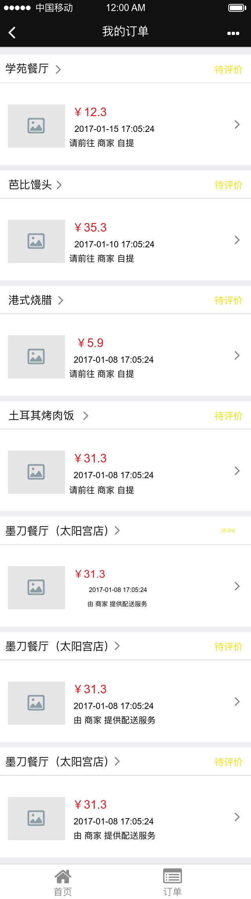
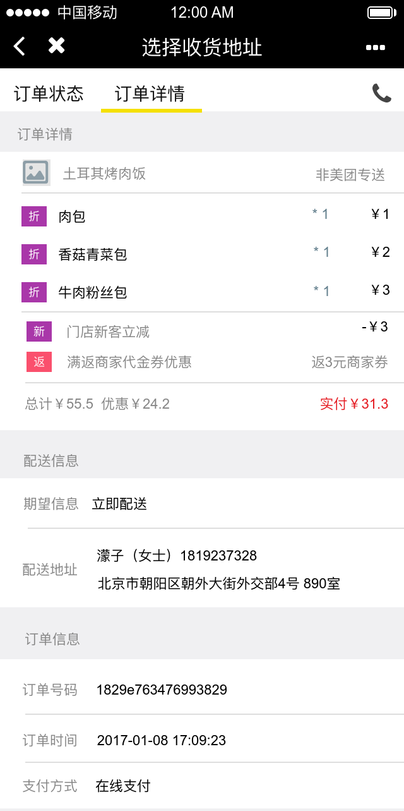
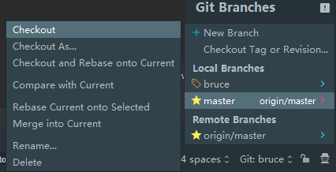
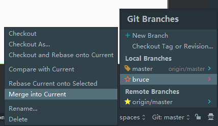
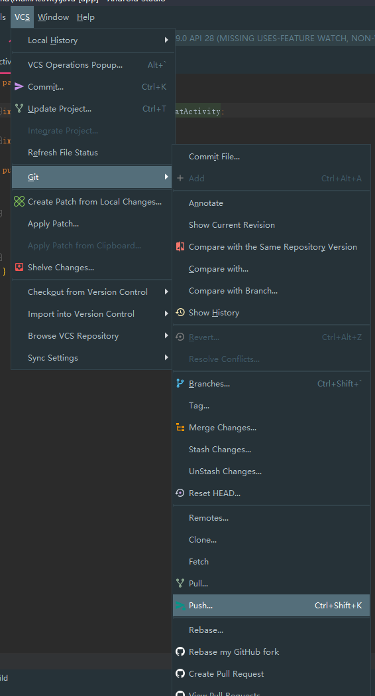
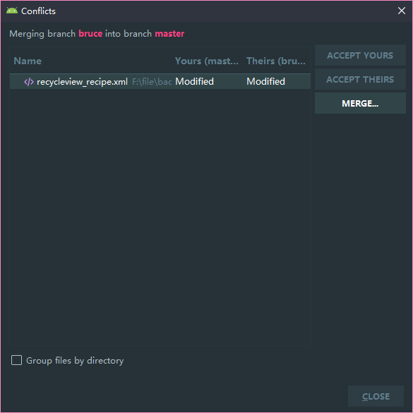
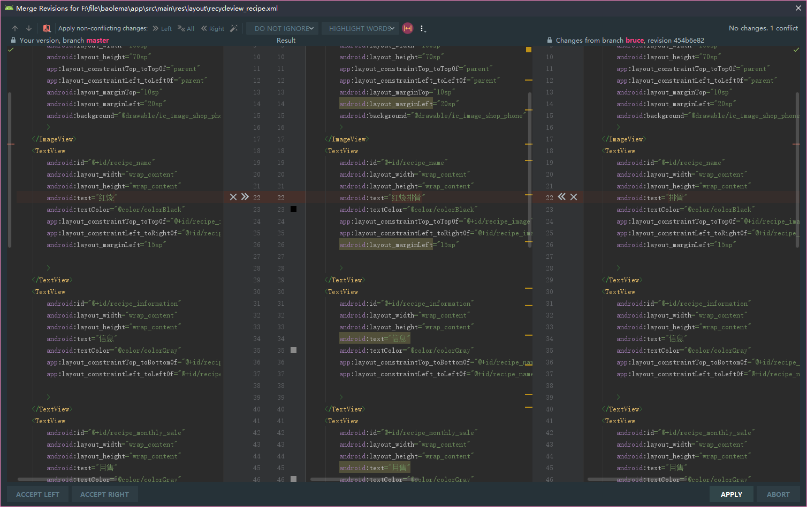

# 规范  

## 编译环境

* 统一gradle的版本号为5.4.1  
```gradle
apply plugin: 'com.android.application'

android {
    compileSdkVersion 29
    buildToolsVersion "29.0.2"
    defaultConfig {
        applicationId "com.example.baolema"
        minSdkVersion 24
        targetSdkVersion 29
        versionCode 1
        versionName "1.0"
        testInstrumentationRunner "androidx.test.runner.AndroidJUnitRunner"
    }
    buildTypes {
        release {
            minifyEnabled false
            proguardFiles getDefaultProguardFile('proguard-android-optimize.txt'), 'proguard-rules.pro'
        }
    }
}

dependencies {
    implementation fileTree(dir: 'libs', include: ['*.jar'])
    implementation 'androidx.appcompat:appcompat:1.0.2'
    implementation 'androidx.constraintlayout:constraintlayout:1.1.3'
    implementation 'androidx.navigation:navigation-fragment:2.0.0'
    implementation 'androidx.navigation:navigation-ui:2.0.0'
    implementation 'androidx.lifecycle:lifecycle-extensions:2.0.0'
    implementation 'im.unicolas:trollbadgeview:1.3'
    implementation 'com.flipboard:bottomsheet-core:1.5.1'
    testImplementation 'junit:junit:4.12'
    androidTestImplementation 'androidx.test.ext:junit:1.1.0'
    androidTestImplementation 'androidx.test.espresso:espresso-core:3.1.1'
}
```

------
## 命名  

* 所有布局文件,素材以小写字母,下划线连接来命名,布局文件名参考对应例图名称命名  

* 类与接口每个单词首字母大写,如DataOrderAdapter  

* 文件夹名全小写字母  

* 常量全大写,下划线连接  

* 方法名和实例名首单词小写,后面首字母大写 ,如onCreate()  

* 同类型实例名尽量保持前缀相等,如strCustomerFirst和strCustomerLast，而不是strFirstCustomer和strLastCustomer  

------

## 示例  
* **应用主页**,点击地址进入[地址选择页面](),点击商家进入商家页,点我的进入[用户详情页](),点订单看[所有订单]()   

  

* **地址选择**随便列几个食堂(可以点)  

  
  
* **店铺菜单**,点击加号同时购物车更新信息,点“商家”切入[商家详情页](),点[购物车]()弹出详情  

  
  
* **商家详情页**,电话+地址+公告,评论区样式暂定或随意发挥  

  

* **购物车**,点加号加一份,减号少一份,只有一份直接删,点清空就清空,点结算进[提交订单页]()  

  

* **提交订单页**,自提时间就是预计可以去拿的时间,支付方式可以砍掉,最上一栏为个人信息及食堂店铺地址,中间列出买的菜及数量价格,活动折扣类向内缩进4个空格,底栏显示优惠金额与实际需支付金额  

  
  
* **用户个人页**
  

* **订单页**
  

* **订单详情页(订单状态)**
  

* **订单详情页(订单明细)**
  

* ……

## android studio代码同步  

### 对master分支做操作时必须先pull一下  

  

> origin/master打勾就行  

### 开始开发  

**1** 点`new branch`新建本地分支  

> `checkout tag...`:切换版本(应该用不到,别点)
>
> `local branches`:本地的分支  
>
> `remote branches`:远程仓库的分支  

**2** 分支取个名字  

在这里也可以随时切换分支  

> `checkout branch`:切换到新建的这个分支  

**3** 切到自己的分支再做改动就影响不到主分支了,写好一次改动且不报错后可以提交改动  

> 底下就是改前改后对比,给要提交改动的文件打上勾后点commit(commit message一定要写自己干了啥)  

**4** 提交成功后切回主分支,然后执行一开始的pull操作,如果别人更新过主分支了你的本地也就同步了,所以你自己的分支相当于是从当前新版主分支的前一个版本的开始写的  

**5** 开始把你的分支合并到新的分支如果没什么冲突就合并成功了  

> `merge into current`:把指定的这个分支合并到当前分支,合并的就是你的commit改动  

一切ok了就可以同步了,checkout回主分支下push,当然也可以顺便push自己分支,这样github上就也有自己的分支了

  

> `push`:把你这个分支做的改动,以及commit信息全部同步到远程仓库,这样github上就更新好了

最后可以顺便切回自己分支然后把最新的主分支合并过来  

### 处理冲突  

#### 产生冲突原因:

> 你忘记pull了,同时碰巧有人已经更新过远程仓库了,你做了push操作
>
> 你pull了一下发现有个大佬改了一个文件的内容,你的分支里有个commit也改了这个文件,这时候你把自己分支合并到主分支  

* 出现冲突android studio会提醒点下冲突的文件然后点merge

左边是主分支的这个文件,右边是你的分支的这个文件,中间是最终merge后效果

>  `白色箭头`:采用用这块改动(如果点一下左边白色箭头中间就变成`红烧`,点右边箭头中间变`排骨`)
>
>  `白色×`:不用,无视这块改动

或者自己在中间手动改  

冲突全搞完了就可以push了  