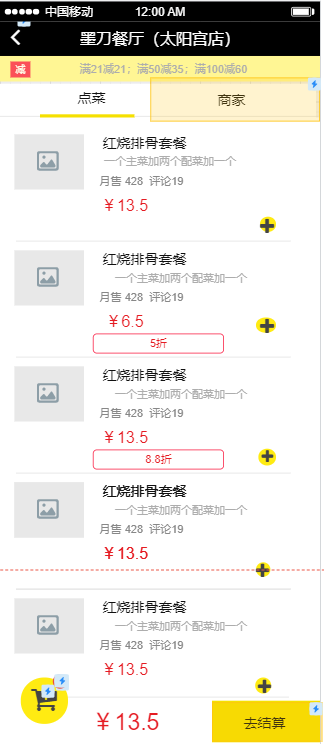
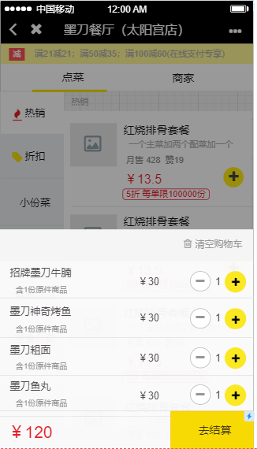

# 规范  

## 编译环境

* 统一gradle的版本号为?

------
## 命名  

* 所有布局文件,素材以小写字母,下划线连接来命名,布局文件名参考对应例图名称命名  

* 类与接口每个单词首字母大写,如DataOrderAdapter  

* 文件夹名全小写字母  

* 常量全大写,下划线连接  

* 方法名和实例名首单词小写,后面首字母大写 ,如onCreate()  

* 同类型实例名尽量保持前缀相等,如strCustomerFirst和strCustomerLast，而不是strFirstCustomer和strLastCustomer  

------

## 示例  
* **应用主页**,点击地址进入[地址选择页面](),点击商家进入商家页,点我的进入[用户详情页](),点订单看[所有订单]()   

  

* **地址选择**随便列几个食堂(可以点)  

  
  
* **店铺菜单**,点击加号同时购物车更新信息,点“商家”切入[商家详情页](),点[购物车]()弹出详情  

  
  
* **商家详情页**,电话+地址+公告,评论区样式暂定或随意发挥  

  

* **购物车**,点加号加一份,减号少一份,只有一份直接删,点清空就清空,点结算进[提交订单页]()  

  

* **提交订单页**,自提时间就是预计可以去拿的时间,支付方式可以砍掉,最上一栏为个人信息及食堂店铺地址,中间列出买的菜及数量价格,活动折扣类向内缩进4个空格,底栏显示优惠金额与实际需支付金额  

  
  
* **用户个人页**  

* **订单页**  

* ……